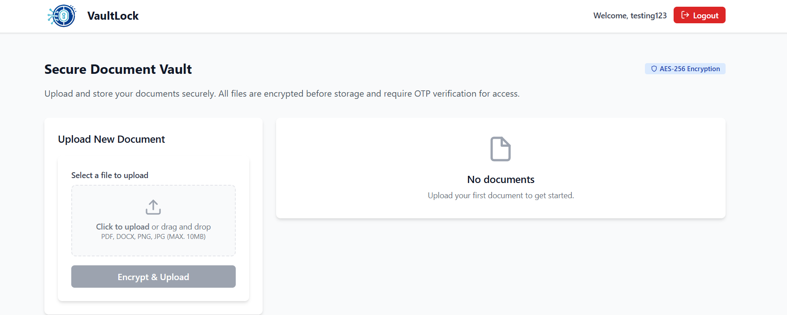
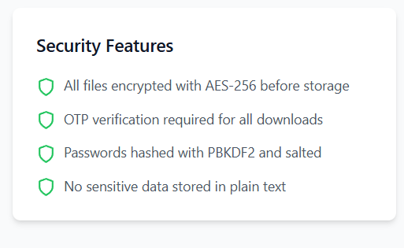
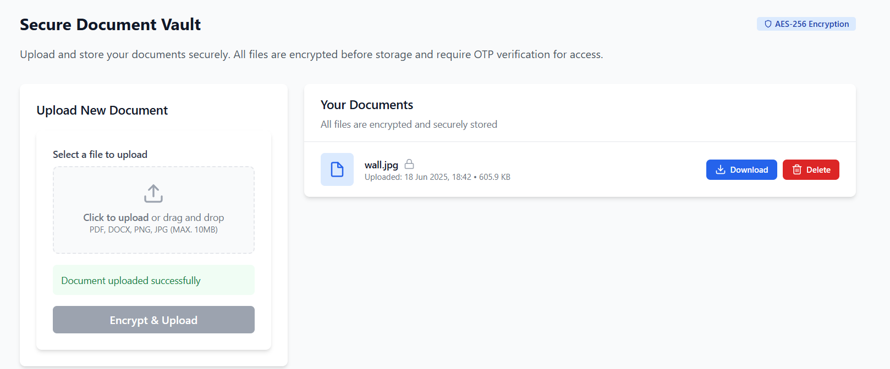

# 🔐 VaultLock

**Author:** Muhammad Abid  
**Year:** 2025  

## Overview
VaultLock is a next-gen, client-side encrypted document vault that ensures your files stay 100% private—even we can't read them. Built with military-grade encryption, a sleek interface, and a zero-knowledge approach, it's security that just works.

## 🚀 Key Features
- 🔐 End-to-End Encryption (AES-256)
- 🔑 Zero-Knowledge Architecture – We never see your files
- 🧂 PBKDF2 Password Hashing with 128-bit salt
- ✅ Two-Factor Authentication with OTP
- 📁 Encrypted Upload, Storage & Download
- 🗑️ Crypto-Shredding for permanent deletion
- 🌐 Offline-Ready – Uses browser's IndexedDB
- 🧭 Mobile-First, Responsive UI
- 👁️‍🗨️ Real-Time Feedback + Animation

## 🛡️ How It Works
Step	Action
- 🔑	Login with password (PBKDF2-secured)
- 🗂️	Upload files (AES-256 encrypted on client)
- 💾	Files stored securely in IndexedDB
- 📥	Download by entering OTP (default: 123456)
- 🧨	Delete securely with crypto-shredding

## 🧰 Tech Stack
- Component	Tech
- Frontend	React 18
- Encryption	CryptoJS (AES, PBKDF2)
- Storage	IndexedDB + localStorage
- Styling	Tailwind CSS
- Icons	Feather Icons via React Icons
- Build Tool	Create React App (CRA)

## 🔐 Security At a Glance
- AES-256 Encryption + Unique IV per File
- PBKDF2 Key Derivation (1000 iterations)
- OTP Verification for File Access
- Session Expiry, Device Binding
- Document Audit Logs

## 📦 Default Settings (For Demo/Test)
## 🔢 OTP for Decryption/Download: 123456

## 📸 Screenshots

## 🛣️ Roadmap Highlights
- 🔐 Biometric Login via WebAuthn
- 🔗 Encrypted File Sharing with Expiry
- 🧠 AI-based Access Anomaly Detection
- 🌍 Cross-Device Sync & Blockchain Auditing

## 🧪 Ideal For
- 🧾 Legal Firms – Case file protection
- 🏥 Healthcare – HIPAA-compliant storage
- 🏛️ Government – Secure classified docs
- 💰 Finance – Encrypted audit logs

## 📣 Final Word
VaultLock isn't just secure. It's future-ready. From quantum-resistant cryptography to AI-powered document scanning—VaultLock is your fortress for digital documents.

## 🔏 Your files. Your rules. Our vault.